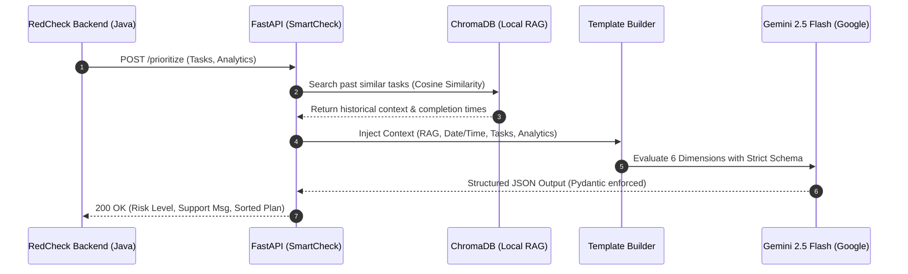
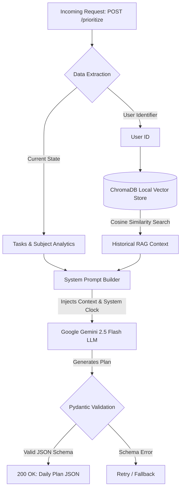

# SmartCheck AI Engine


SmartCheck AI Engine is the standalone intelligence microservice for the **RedCheck** productivity platform. It leverages Retrieval-Augmented Generation (RAG) and Google's Gemini 2.5 models to evaluate pending tasks and return a mathematically optimized, structured daily execution plan in seconds.

## Architecture & AI Flow

The engine operates strictly as a deterministic JSON generator. It combines real-time data from the main backend (Spring Boot) with local vector memory to orchestrate tasks without hallucinations.

### 1. Component Interaction (Sequence)



### 2. Request Processing & RAG Flowchart



**The 6-Dimension Prioritization Matrix**

To determine the optimal `definedOrder` for each task, the system dynamically evaluates:

1. **Urgency (System Clock):** Compares exact due dates against the injected container runtime clock.
2. **AI Delegation Potential:** Evaluates if a task's execution can be accelerated by delegating repetitive code or boilerplate structures to AI tools, advising the user accordingly in the generated reasoning to reserve human focus for complex architectural design.
3. **Historical RAG Memory:** Adjusts risk levels based on past task execution data stored locally in ChromaDB.
4. **Cognitive Effort:** NLP analysis of task density.
5. **Implicit Dependencies:** Logical execution blockers (e.g., DB config before API endpoints).
6. **Subject/Project Balance:** Pushes tasks from neglected academic subjects or projects to the top to prevent imbalances.

## API Endpoints

* `GET /health` - Service heartbeat.
* `POST /api/v1/prioritize` - Main orchestration endpoint. Receives user analytics, profile, and tasks, returning a strict JSON schema.

## Getting Started

### Prerequisites

* Python 3.12+
* Google Gemini API Key

### Local Development

1. Clone the repository and navigate to the root directory.
2. Create and activate a virtual environment:
```bash
python -m venv venv
source venv/bin/activate

```

3. Install dependencies:
```bash
pip install -r requirements.txt

```

4. Create a `.env` file in the root directory and add your API key:
```env
GEMINI_API_KEY=your_google_ai_studio_key_here

```

5. Run the server:
```bash
uvicorn app.main:app --reload

```

6. Visit `http://localhost:8000/docs` to test the API via the Swagger UI.

### Docker Deployment

This project uses a multi-stage Dockerfile to minimize image size and runs under a non-root user for enhanced security.

```bash
docker build -t smartcheck-ai-engine .
docker run -d -p 8000:8000 --env-file .env -v chroma_data:/app/chroma_data smartcheck-ai-engine

```

*(Note: Ensure the local `chroma_data` directory is mounted as a volume to persist the vector database between container restarts).*

## Copyright and License
This project is licensed under the **GNU Affero General Public License v3.0 (AGPLv3)**.
