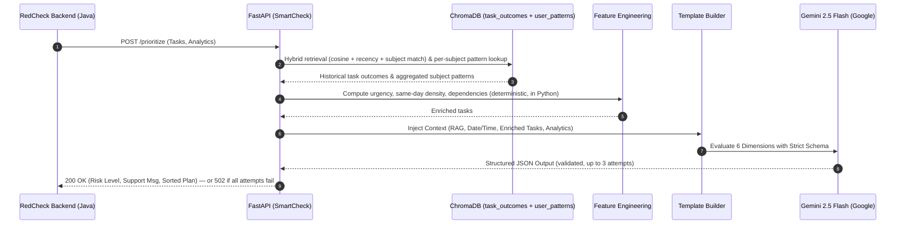
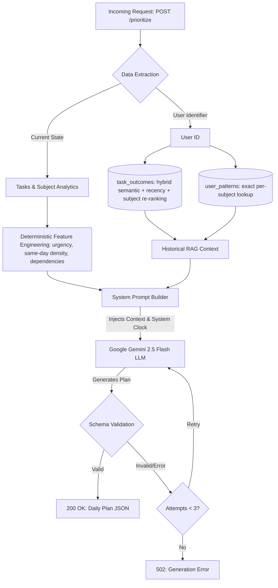

# SmartCheck AI Engine


SmartCheck AI Engine is the standalone intelligence microservice for the **RedCheck** productivity platform. It leverages Retrieval-Augmented Generation (RAG) and Google's Gemini 2.5 models to evaluate pending tasks and return a mathematically optimized, structured daily execution plan in seconds.

## Architecture & AI Flow

The engine operates strictly as a deterministic JSON generator. It combines real-time data from the main backend (Spring Boot) with local vector memory to orchestrate tasks without hallucinations.

### 1. Component Interaction (Sequence)



### 2. Request Processing & RAG Flowchart



> **Implementation status:** this diagram is implemented end-to-end for the `/prioritize` path. The RAG side ingests via a separate endpoint, `POST /api/v1/tasks/outcome` (see [API Endpoints](#api-endpoints)) — **the RedCheck backend still needs to be wired to call it** after a task is completed/postponed for `task_outcomes`/`user_patterns` to actually accumulate history in production; until then, both collections stay empty and the RAG context above is effectively blank (the rest of the flow still works, just without historical grounding).

**The 6-Dimension Prioritization Matrix**

To determine the optimal `definedOrder` for each task, the system dynamically evaluates:

1. **Urgency (Deterministic):** Days-to-due-date and an urgency bucket (`atrasada`/`critica`/`proxima`/`normal`/`sin_fecha`) are computed in Python before the prompt is built — the LLM is instructed to trust these fields rather than compare dates itself.
2. **AI Delegation Potential:** Evaluates if a task's execution can be accelerated by delegating repetitive code or boilerplate structures to AI tools, advising the user accordingly in the generated reasoning to reserve human focus for complex architectural design.
3. **Historical RAG Memory:** Combines individual past task outcomes (hybrid retrieval — semantic similarity, recency, and subject-match re-ranking) with an aggregated per-subject performance pattern (completion rate, average delay, AI-order adherence — recomputed after every new outcome) stored locally in ChromaDB, across two purpose-built collections.
4. **Cognitive Effort:** Task complexity plus same-day task density (also precomputed in Python) — several tasks clustered on the same due date raise that day's cognitive load.
5. **Explicit/Implicit Dependencies:** When a task declares `dependeDe`, blocking dependencies among the pending tasks are resolved deterministically in Python; the LLM only infers logical blockers from free text (e.g., DB config before API endpoints) when that field is absent.
6. **Subject/Project Balance:** Pushes tasks from neglected academic subjects or projects to the top to prevent imbalances.

## API Endpoints

* `GET /health` - Service heartbeat.
* `POST /api/v1/prioritize` - Main orchestration endpoint. Receives user analytics, profile, and tasks, returning a strict JSON schema.
* `POST /api/v1/tasks/outcome` - Ingestion endpoint. Receives the real-world outcome of a task (completed/postponed/overdue, actual vs. due date, whether the user followed the AI-suggested order), embeds it into the `task_outcomes` collection, and recomputes that subject's aggregated pattern in `user_patterns`. Intended to be called by the RedCheck backend whenever a task's state changes — no existing caller does this yet.

## Roadmap

The RAG started as a single vector lookup feeding one Gemini call. The items below track its evolution into the hybrid, multi-collection, retry-validated pipeline described above, in the order they were tackled:

1. ~~**Close the ingestion loop.**~~ ✅ Done — `POST /api/v1/tasks/outcome` embeds task outcomes (actual vs. estimated completion time, delay, whether the user followed the suggested order) into ChromaDB. Still pending: wiring the RedCheck backend to actually call it after a task is completed/postponed.
2. ~~**Deterministic feature engineering.**~~ ✅ Done — `app/services/feature_engineering.py` precomputes `diasParaVencer`/`urgencia`, `tareasMismoDia`, and `dependenciasPendientes`/`estaBloqueada` in Python and injects them into each task before it reaches the prompt; `prompts/smartcheck.txt` instructs the LLM to trust these fields over its own reading of raw dates/text. Field names confirmed against RedCheck's actual `SmartCheckAIService` (`titulo`, `fechaLimite`, `asignatura` — Spanish, subject name already resolved server-side). `dependeDe` (dependencies) isn't sent by Java yet, so that signal stays inert until it's added on the Java side.
3. ~~**Multi-collection structured RAG.**~~ ✅ Partially done — the single `user_tasks_history` collection is now two purpose-built ones: `task_outcomes` (individual task outcome records, semantic search) and `user_patterns` (one aggregated doc per user+subject — completion rate, average delay, AI-order-adherence rate — recomputed from `task_outcomes` and exact-matched by subject, not semantic search). `app/services/vector_store.py`'s `build_rag_context` synthesizes both into a single labeled context block. The third planned collection, **plan-adherence feedback** (whether a whole day's plan/risk-level prediction was accurate), is deferred — it needs a way to group multiple task outcomes back to the specific AI-generated plan they came from, which nothing currently tracks (no "which plan was this task part of" identifier exists yet).
4. ~~**Agentic pipeline.**~~ ✅ Partially done — `app/services/llm_engine.py` now retries up to 3 times, validating each response against `PrioritizationResponse` (not just parsing it as JSON) before accepting it; after all attempts fail, `/prioritize` returns a clean `502` instead of an unhandled crash. Deterministic signal-gathering (`feature_engineering.py`, `vector_store.py`) was already separated from LLM reasoning as of phases 2–3. **Deferred:** letting the model request more historical context via function calling — this needs a real multi-turn tool-use loop (a materially bigger change: Gemini function-calling API, multiple round-trips, deciding what "tools" to expose) and the current single-shot RAG retrieval already covers the common case reasonably well, so it's deferred rather than built speculatively.
5. ~~**Hybrid retrieval + re-ranking.**~~ ✅ Done — `query_task_outcomes` (`app/services/vector_store.py`) now pulls a wider candidate pool (8) by semantic similarity, then re-ranks combining semantic similarity, **recency** (a smooth decay — more recent outcomes are more predictive of current behavior than old ones) and **subject match** against today's tasks' `asignatura` values, instead of returning Chroma's raw top-3. This also caught and fixed a real, longstanding gap: `hnsw:space` was never set on the ChromaDB collections, so retrieval was actually running on **squared L2 distance**, not cosine similarity, despite every diagram in this README claiming otherwise — both collections now explicitly use `{"hnsw:space": "cosine"}`. "Task type" from the original plan was dropped — there's no such field anywhere in the data model (see the Java DTOs) to filter on.

## Getting Started

### Prerequisites

* Python 3.12+
* Google Gemini API Key

### Local Development

1. Clone the repository and navigate to the root directory.
2. Create and activate a virtual environment:
```bash
python -m venv venv
source venv/bin/activate

```

3. Install dependencies:
```bash
pip install -r requirements.txt

```

4. Create a `.env` file in the root directory and add your API key:
```env
GEMINI_API_KEY=your_google_ai_studio_key_here

```

5. Run the server:
```bash
uvicorn app.main:app --reload

```

6. Visit `http://localhost:8000/docs` to test the API via the Swagger UI.

### Docker Deployment

This project uses a multi-stage Dockerfile to minimize image size and runs under a non-root user for enhanced security.

```bash
docker build -t smartcheck-ai-engine .
docker run -d -p 8000:8000 --env-file .env -v chroma_data:/app/chroma_data smartcheck-ai-engine

```

*(Note: Ensure the local `chroma_data` directory is mounted as a volume to persist the vector database between container restarts).*

## Copyright and License
This project is licensed under the **GNU Affero General Public License v3.0 (AGPLv3)**.
